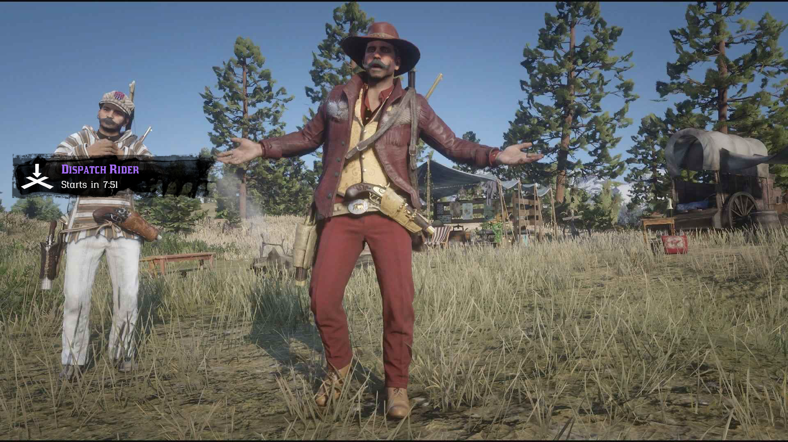
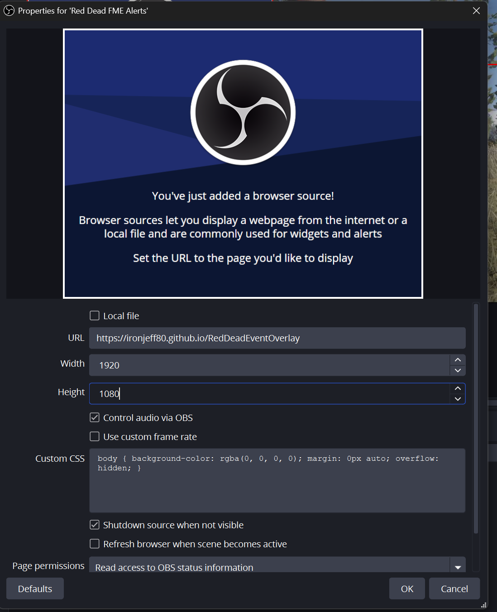

# 🤠 Red Dead Online Event Overlay
> **Never miss a Trade Route or Condor Egg again with professional, automated notifications.**

This is a professional, real-time overlay designed specifically for Red Dead Online streamers. It features a globally synced UTC schedule, custom RDR-style typography, and deep Streamer.bot integration to keep you and your chat informed.

---

## ✨ Features
* 🌍 **Global UTC Sync:** Zero manual setup. Whether you're in PST, EST, or GMT, the schedule stays 100% accurate without Daylight Savings headaches.
* 🔔 **Auto-Notifications:** A notification "toast" slides in exactly 10 minutes before every event.
* 💬 **Chat Commands:** Full integration for `!fme` for the next event or specific event lookups (e.g., `!fme trade route` or `!fme tr`, `!fme King of the castle` or `!fme kotc`, `!fools gold` or `!fme fg` ect).
* 🎨 **RDR Aesthetic:** Matches the RDO interface with high-quality icons and game-accurate fonts.
* 🔊 **Audio Alerts:** Built-in spatial sound notification with customizable volume.

---

## 📸 Preview

---

## 🛠️ Setup Instructions

1. OBS Browser Source

    Add Source: Create a new Browser Source in OBS.

    URL: https://ironjeff80.github.io/RedDeadEventOverlay.

    Dimensions: Set Width to 1920 and Height to 1080.

    Check "Control Audio via OBS" to manage the alert volume through the OBS mixer. and "Shutdown source when not visible" so alerts dont fire while you have the source hidden.

2. Streamer.bot Integration

    Import: Drag and drop streamerBotImport.txt into Streamer.bot's import window.

    WebSocket: Ensure your server is running on 127.0.0.1:8080 (the default).

    Commands: The overlay will now listen for the fme global variable and respond to chat commands automatically.

## 📜 Credits

    Typography: RDR Lino & Hapna Slab Serif.

    Logic: Built for the RDO Community.

    Assets: Inspired by Rockstar Games' Red Dead Online.